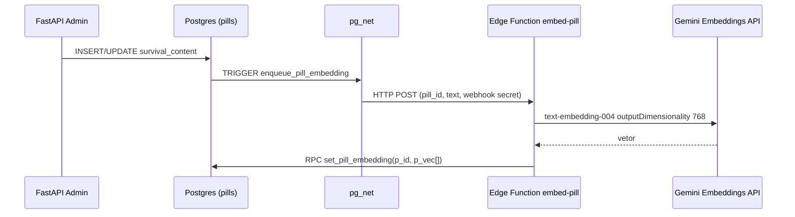

# HelpProf — Backend, Supabase e manutenção

Este documento descreve **como o MVP do backend HelpProf está organizado**, quais bibliotecas e configurações existem e **como dar manutenção** sem precisar de comentários em cada linha de código. Para detalhes de API use sempre o Swagger em **`/docs`** com o servidor em execução.

---

## 1. Propósito do sistema

**HelpProf** é uma API REST (FastAPI) que:

- Serve **pílulas** (conteúdo curto em Markdown — modo “sobrevivência”) com **ranking por visualizações**.
- Associa **guias de domínio** (conteúdo aprofundado por ferramenta).
- Expõe a **Lume**, assistente de IA com triagem de escopo, busca semântica+lexical e dois modos: **Home (intenção vaga)** e **dentro da pílula (contexto estrito)**.
- Permite ao **painel Triad Support** criar/atualizar conteúdo com **JWT do Supabase Auth** usando a **service role** apenas no servidor (credencial nunca no browser público).
- Enfileira **embeddings de 768 dimensões** (compatível Google `text-embedding-004`) via **PostgreSQL trigger + pg_net → Edge Function** (ou webhook opcional na própria API).

O frontend estático atual (`index.html`, etc.) **não** é obrigatoriamente o consumidor único — qualquer cliente HTTP pode usar a mesma API.

---

## 2. Mapa do repositório (o que está onde)

```
ProjetoPrototipo/
├── backend/
│   ├── .env.example          # modelo de variáveis (copiar para backend/.env)
│   ├── requirements.txt      # dependências Python
│   └── app/
│       ├── main.py           # FastAPI: CORS, exceções, montagem das rotas
│       ├── config.py         # Pydantic Settings + carregamento de .env
│       ├── api/
│       │   ├── deps.py               # JWT do admin (Triad Support)
│       │   ├── limiter_ext.py        # slowapi (rate limit das views)
│       │   └── routers/               # pills, admin, lume, health, embed, domain guides
│       ├── core/
│       │   └── errors.py              # Hierarquia HelpProfError → HTTP handlers
│       ├── models/
│       │   └── schemas.py             # Pydantic entrada/saída
│       └── services/
│           ├── ai/                     # Gemini: embeddings, guardrail, Lume (LlamaIndex LLM)
│           └── db/                     # cliente Supabase, busca híbrida RPC
├── supabase/
│   ├── migrations/*.sql               # Schema, RPCs, RLS, trigger pg_net
│   └── functions/embed-pill/index.ts # Edge Function: embed + UPDATE via RPC
└── docs/
    └── HelpProf-backend.md            # Este arquivo
```

Os arquivos HTML/CSS/JS na raiz do projeto são o **protótipo de frontend** e podem evoluir separadamente; a camada oficial de integração nova é **`/api/v1`**.

---

## 3. Stack técnico e bibliotecas

| Área | Tecnologia | Papel |
|------|-------------|-------|
| **Runtime** | Python 3.10+ | Linguagem da API |
| **Framework HTTP** | `fastapi` | Rotas REST, validação OpenAPI automática (`/docs`) |
| **Servidor ASGI** | `uvicorn[standard]` | Execução em desenvolvimento e produção |
| **Config** | `pydantic` + `pydantic-settings` | Tipagem de env e `.env` |
| **Segredos locais** | `python-dotenv` (via pydantic-settings) | Arquivo `backend/.env` |
| **Banco / API de dados** | `supabase` (client oficial) | PostgREST + RPC + service_role/a no servidor |
| **Rate limit público** | `slowapi` | Limite de `POST /pills/{id}/view` (anti-inflação de views) |
| **JWT admin** | `PyJWT[crypto]` | Valida Bearer do usuário Supabase Auth |
| **Embeddings + guardrail** | `google-genai` | `Client.models.embed_content` / `generate_content` (`text-embedding-004`, `gemini-*`) |
| **LLM no fluxo LlamaIndex** | `llama-index-core`, `llama-index-llms-google-genai` | `GoogleGenAI` como LLM Gemini 1.5 Flash sobre prompts montados pela aplicação |
| **HTTP genérico** | `httpx` | Presente transitivamente útil para extensões; não obrigatório em todo caminho atual |

Infra declarada mas **executada na nuvem Supabase**:

| Recurso | Extensão / produto |
|---------|---------------------|
| **Vetores** | `vector` em schema `extensions` (pgvector), dimensão **768** |
| **Webhook assíncrono do BD** | `pg_net`, função `net.http_post` |
| **Deploy serverless embeddings** | **Supabase Edge Functions** (Deno/TypeScript em `embed-pill`) |

LangChain não é usado deliberadamente; o RAG é **enxuto**: RPCs Postgres + texto agregado + um único LLM LlamaIndex.

---

## 4. Arquitetura conceitual

### 4.1 Camadas da aplicação Python

1. **`routers/`** — Recebem HTTP, validam com schemas Pydantic, chamam services. Não contêm SQL duplicado além das chamadas ao cliente Supabase/RPC.
2. **`services/db/`** — `supabase_client.py` encapsula cliente com **service role** (bypass RLS, uso exclusivo no backend). `retrieval.py` implementa busca **lexical + semântica** via RPC `match_pills_lexical` e `match_pills_semantic`.
3. **`services/ai/`** — Geram embeddings (`embeddings.py`), triagem moral/técnica (`guardrail.py`) e fluxo **`run_lume`** (`lume.py`): guardrail → (pill | home retrieval) → resposta Gemini via LlamaIndex.
4. **`core/errors.py`** + **`main.py`** — Erros padronizados JSON; stack trace só em **não-produção** (`ENVIRONMENT=production`).
5. **`config.py`** — Único lugar para ler `SUPABASE_*`, `GEMINI_*`, lista de admins, CORS e limiares de similaridade (`LUME_SIMILARITY_FLOOR`).

Separação de responsabilidades evita misturar regra de negócio com infraestrutura HTTP.

### 4.2 Fluxo de embeddings (assíncrono)



Se `app.embed_function_url` ou `app.embed_webhook_secret` não estiverem configurados no banco, o trigger **avisará** nos logs Postgres e não dispara chamada externa (as pílulas existem, mas ficam sem vetor até outro fluxo manual).

Fluxo alternativo documentado na API: **`POST /api/v1/internal/embeddings/pill`** no FastAPI (mesmo cabeçalho `X-Embed-Webhook-Secret` que a Edge espera).

### 4.3 Fluxo da Lume (pergunta do professor)

1. **Guardrail** (`guardrail.py`) — Gemini barato rápido: JSON `dentro_escopo`. Se falso → resposta fixa educativa (sem RAG grande).
2. **Cenário `pill`** — Busca texto da pílula no Supabase, injeta no prompt como **única verdade factual**.
3. **Cenário `home`** — `hybrid_pill_search`: embeddings da pergunta + RPC semântico e lexical; combina ordenação; marca **baixa confiança** se similaridade média ficar abaixo de `LUME_SIMILARITY_FLOOR`; preenche sugestões de perguntas a partir das tags quando útil.
4. **Persistência da curadoria** — `_log_search` grava **`search_logs`** (service role) para o dashboard posterior.

---

## 5. Configuração (onde editar cada coisa)

### 5.1 Arquivo **`backend/.env`**

Copie de **`backend/.env.example`**. Principais variáveis:

| Variável | Uso |
|----------|-----|
| `SUPABASE_URL` | URL do projeto |
| `SUPABASE_SERVICE_ROLE_KEY` | Backend exclusivamente; não expor ao frontend público |
| `SUPABASE_ANON_KEY` | Opcional; o MVP atual usa majoritariamente service role no servidor |
| `SUPABASE_JWT_SECRET` | Validar Bearer do Auth no painel admin |
| `ADMIN_EMAILS` | CSV opcional; vazio permite qualquer usuário **autenticado** |
| `GEMINI_API_KEY` | Google AI Studio |
| `EMBED_WEBHOOK_SECRET` | Igual ao segredo do trigger e ao secret da Edge |
| `LUME_SIMILARITY_FLOOR` / `LUME_LEXICAL_FALLBACK_LIMIT` | Ajuste fino do RAG Home |
| `CORS_ORIGINS` | Lista CSV de origens do browser permitidas |
| `ENVIRONMENT` | `production` suprime traceback em erro 500 |

O carregamento de `.env` procura sempre **`Projeto.../backend/.env`** (caminho relativo ao `config.py`), depois opcional `.env` no cwd.

### 5.2 Supabase Dashboard

- **Settings → API**: URL e chaves, **JWT Secret** (JWT do admin usa isso ou documentação atual do projeto sobre HS256).

### 5.3 Postgres (SQL Editor ou config autorizada pelo provedor)

- Definir `app.embed_function_url` para a URL pública da função **`embed-pill`**.
- Definir `app.embed_webhook_secret` igual ao `EMBED_WEBHOOK_SECRET`/secret da Edge.

Formato típico (ajuste valores reais):

```sql
ALTER DATABASE postgres SET app.embed_function_url TO 'https://SEU_REF.supabase.co/functions/v1/embed-pill';
ALTER DATABASE postgres SET app.embed_webhook_secret TO 'um_segredo_forte_compativel_env';
```

(Em ambientes hospedados, às vezes usa-se Vault/Secret Manager na função PostgreSQL — o princípio é o mesmo: URL + segredo combinando com pg_net.)

### 5.4 Edge Function

Secrets no painel **Edge Functions** (ou CLI): `SUPABASE_URL`, `SUPABASE_SERVICE_ROLE_KEY`, `GEMINI_API_KEY`, `EMBED_WEBHOOK_SECRET`.

---

## 6. Migrações SQL (`supabase/migrations`)

O arquivo inicial cria:

- Tabelas `pills`, `domain_guides`, `search_logs` com **`deleted_at` para soft delete** em pílulas e guias.
- Extensões `vector` e `pg_net`.
- Funções **`match_pills_lexical`** e **`match_pills_semantic`** (cosine similarity).
- RLS permitindo SELECT público (anon/authenticated) em pílulas guião **ativo** (`deleted_at IS NULL`); **sem política INSERT** em `search_logs` para público (apenas backend com service role escreve).
- Trigger **`enqueue_pill_embedding`** após mudanças em **`survival_content`**.
- RPCs **`set_pill_embedding`** (service_role), **`increment_pill_views`** (service_role).

Migração posterior **`20260506120000_pills_slides_tool_category`**:

- Coluna opcional **`pills.slides_url`** — URL **`/pubembed`** do Google Slides.
- **`pills.tool_category`** com **`CHECK`** nos valores **`ONEDRIVE`**, **`WORD`**, **`EXCEL`**, **`WHATSAPP`**, **`CANVA`**, **`SED`**, **`CMSP`** (com `UPDATE` best-effort de rótulos legados antes do constraint).

**Manutenção:** novo índice, nova coluna, nova política → **nova migração** com timestamp, nunca edição irrestrita sem histórico no time.

---

## 7. Contrato REST (visão rápida)

Prefixo base: **`/api/v1`**.

| Contexto | Métodos e caminhos (resumo) |
|----------|-------------------------------|
| Público | `GET /pills/trending`, `GET /pills/{id}`, `POST /pills/{id}/view` (rate limit) |
| Guia domínio | `GET /domain-guides/by-category/{tool_category}` |
| IA | `POST /lume/query` corpo `{ "query", "scenario": "home" \| "pill", "pill_id"? }` |
| Admin | `POST/PATCH /admin/pills`, `DELETE /admin/pills/{id}` (soft delete), guias sob `/admin/domain-guides` |
| Diagnóstico | `GET /health` |
| Interno (sem OpenAPI) | `POST /internal/embeddings/pill` com header de segredo |

Autenticação admin: **`Authorization: Bearer <access_token>`** dos usuários Supabase Auth válidos pela `SUPABASE_JWT_SECRET`.

---

## 8. Por que há poucos comentários linha-a-linha

A equipe pretendia **nomear bem módulos e funções** e centralizar comportamento repetido (`supabase_call`, schemas, routers finos). Comentários longos dentro de código duplicariam este documento; **esta página é o mapa oficial de manutenção**.

Quando vale comentário no código?

- invariantes não óbvios (ex.: “nunca remover service role do servidor” já está nos docs mas não em todo handler);
- workarounds de bug de biblioteca até upgrade;
- segurança: risco específico de uma rota.

---

## 9. Como dar manutenção no dia a dia

### 9.1 Subir ambiente local

O pacote Python chama-se **`app`** e fica em **`backend/app`**. Se você rodar o Uvicorn na **raiz** do repositório (`ProjetoPrototipo`) sem ajustar o path, ocorre **`ModuleNotFoundError: No module named 'app'`**.

**Opção A — recomendada (pasta `backend`):**

```bash
cd backend
pip install -r requirements.txt
# .env em backend/.env (ver .env.example)
```

No Windows (PowerShell): `.\run_dev.ps1`  
No Windows (CMD): `run_dev.bat`  
Ou manualmente:

```bash
set PYTHONPATH=%CD%
python -m uvicorn app.main:app --reload --host 0.0.0.0 --port 8000
```

**Opção B — a partir da raiz do repo (sem `cd backend`):**

```bash
python -m uvicorn app.main:app --reload --host 0.0.0.0 --port 8000 --app-dir backend
```

No PowerShell também pode usar: `$env:PYTHONPATH="backend"; python -m uvicorn app.main:app --reload --host 0.0.0.0 --port 8000`

### 9.2 Acrescentar um endpoint público novo

1. Definir schema em **`models/schemas.py`**.
2. Criar função na router correta em **`api/routers/`** ou novo router incluso em **`main.py`**.
3. Lógica de domínio em **`services/`** (preferência: não criar novo acoplamento no `main`).
4. Se precisa de erro semântico, use **`HelpProfError`** ou subclasse já existente.
5. Atualizar **este arquivo** apenas se mudar invariante ou variável obrigatória.

### 9.3 Afinar comportamento da Lume

- **Triagem mais rígida/laxa**: edite apenas **`guardrail.py`** (instruções e formato da resposta).
- **Sensibilidade à busca em Home**: **`LUME_SIMILARITY_FLOOR`** e thresholds internos nos RPC ou em **`retrieval.py`** (limite inferior na chamada `match_pills_semantic` usa `similarity_threshold` dinâmico).
- **Trocar modelo/temperatura LLM**: **`lume.py`**, método `_llm()` e onde `complete()` é chamado.

### 9.4 Embeddings falhando

1. Logs da Edge Function (Supabase) e erro HTTP do Gemini.
2. Postgres: warning do trigger quando faltarem settings `app.embed_*`.
3. Teste webhook FastAPI **`/internal/embeddings/pill`** com segredo igual para ver se o problema é rede pg_net versus Google versus RPC **`set_pill_embedding`**.

### 9.5 Atualizar dependências

- Periodicamente revise **`requirements.txt`**, especialmente `llama-index-*` e `google-*` por mudanças de API.
- Após atualizar Gemini SDK, reflita nos três lugares que tocam Gemini: **`embeddings.py`**, **`guardrail.py`**, **`lume.py`** (idealmente migração unificada para `google.genai` no futuro).

### 9.6 Segurança em produção

- **Nunca** versionar **`backend/.env`**.
- Garantir `ENVIRONMENT=production` onde expõe público para ocultar detalhes 500.
- Cabe HTTPS em frente ao FastAPI no provedor deploy (Railway/Fly/AWS/etc.).
- Rotate **service_role** e **GEMINI_API_KEY** se vazarem; invalidar JWT secret se necessário conforme playbook Supabase.

---

## 10. Glossário rápido

| Termo | Significado aqui |
|-------|-------------------|
| **Soft delete** | `deleted_at` preenchido; sem `DELETE` físico pela API HelpProf admin |
| **Service role** | Chave servidor que bypassa RLS na API Postgres do Supabase — só backend |
| **RPC** | Função Postgres exposta via PostgREST; usada pelo cliente Python |
| **pg_net** | Extensão que emite POST HTTP assíncrono a partir de trigger |
| **Lume** | Nome produto da camada IA (Gemini + regras de escopo e RAG) |

---

Este documento deve ser atualizado quando **rotas públicas**, **variáveis de ambiente obrigatórias** ou **fluxo de embeddings** mudarem substancialmente. O OpenAPI (**`/docs`**) permanece como referência sempre atual dos contratos HTTP.
